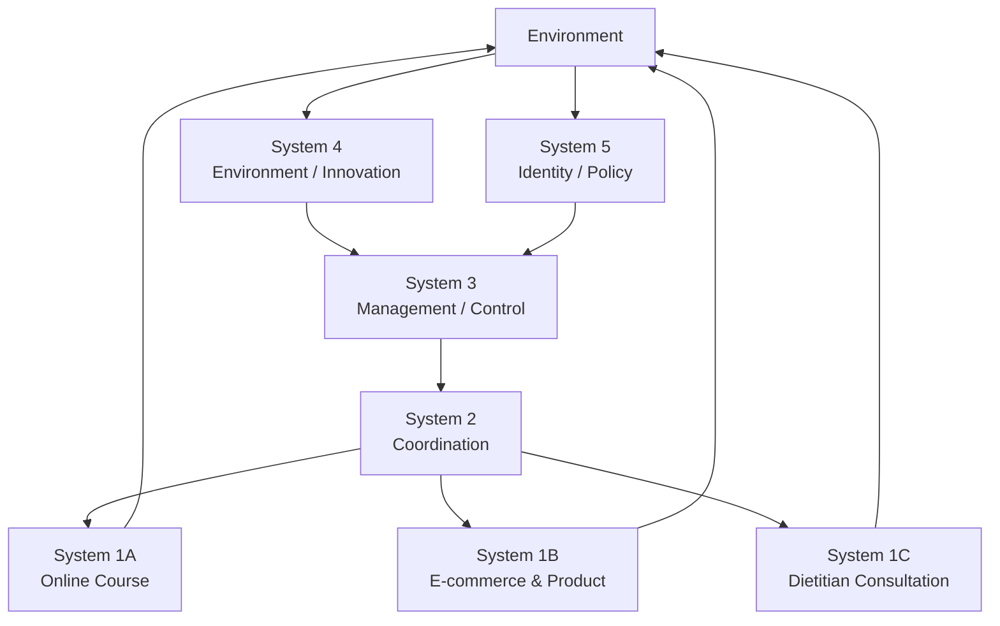

# Harmony Inside – Viable System Model

Academic project for Stockholm University.

## Overview

Applied Stafford Beer's Viable System Model (VSM) to model
the future-state organization of Harmony Inside, a digital
IBS health service company.

## Objective

The project focused on identifying:
- core business units and their environments
- coordination mechanisms across units
- resource allocation and operational control
- environmental scanning and future development
- organizational identity and governance

## Approach

The organization was modeled through VSM Systems 1–5:

System 1 – Primary operational activities
System 2 – Coordination
System 3 – Operational control and resource allocation
System 4 – Environmental scanning and future development
System 5 – Identity and policy

## Key Findings

- Identified three primary business units:
  Online Course, E-commerce & Product, Dietitian Consultation
- Designed cross-unit coordination mechanisms
- Identified tensions between operational stability and digital innovation
- Proposed gradual adoption of AI-enabled services and international expansion

## Deliverables

- VSM System 1–5 tables
- Organizational modeling
- Governance and coordination analysis
- Future-state recommendations

## Tools / Methods

Viable System Model (VSM)
Enterprise Modeling
Business Process Analysis
Systems Thinking
Academic project | Stockholm University | 2026

